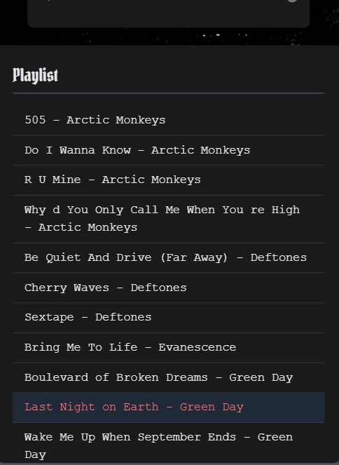

# Music Player Application

## Project Overview

This project is a simple music player application built using Vue.js. It allows users to browse through a playlist of songs, play and pause music, and view song information.

## Features

- **Playlist**: Displays a list of songs with their titles, artists, and album covers.
- **Music Player**: Controls music playback, including play, pause, and seeking.
- **Song Information**: Shows the current song's title, artist, and album cover.

## Technologies Used

- **Vue.js**: A progressive JavaScript framework for building user interfaces.
- **HTML, CSS**: Standard web technologies for structuring and styling content.
- **JavaScript**: Programming language for adding interactivity and logic.

## Installation and Usage

### Clone the repository:

```bash
git clone https://github.com/your-username/music-player.git
```

### Install dependencies:

```bash
cd music-player
npm install
```

### Run the development server:

```bash
npm run dev
```

## Demo

Watch the music player in action in this [video demo](https://drive.google.com/file/d/1Cl60nXTx5jBawtHa-u5kJ_GN27cwQSJy/view?usp=sharing).

## Screenshots

Here are some screenshots of the music player's interface:

### Music Player Controls


### Playlist View


